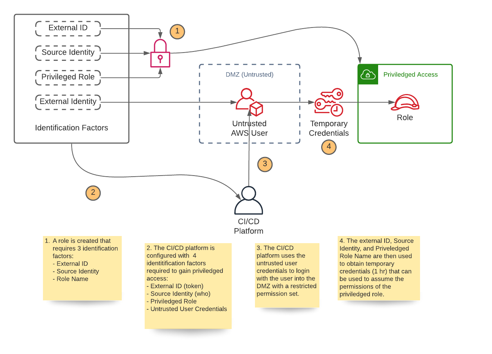

# Bootstrap Cloudformation Template for Generic Third Party CI/CD Setup

## Overview

This template can be used to grant a CI/CD platform access to AWS resources in a generic and secure way. If you are
jumping CI/CD providers with various AWS integrations this could be a generic way to solve access that prevents the need
to use more customized solutions for each provider. An example might be platforms like GitHub Actions that allow OIDC
integrations with AWS, where in CircleCI it is common to use a third-party Orb (aka plugin). Even when switching between
providers that offer OIDC integration (i.e. Github Actions vs Gitlab), the setup is slightly different causing
unnecessary confusion.

References:

- GitHub OIDC
  (https://docs.github.com/en/actions/deployment/security-hardening-your-deployments/configuring-openid-connect-in-amazon-web-services)
- Gitlab OIDC (https://authress.io/knowledge-base/aws-gitlab-cicd-login-authentication)
- CircleCI Orb (https://circleci.com/developer/orbs/orb/cardig/aws-auth)

## Usage

**Identification Factor Requirements**:

- External ID configured in the CI/CD platform
  * A secret generated by trusted party (you or your organization) and stored in AWS Secrets Manager
- Source Identity configured in the CI/CD platform
  * An identity used to identify the trusted platform (i.e. `circleci`)
- IAM Role configured in the CI/CD platform
  * A role is setup inside the secured account with elevated permissions for the CI/CD platform
- IAM User setup in the DMZ (user with restricted permission set)
  * This user only has permissions that allow it to assume the elevated role given they have the previous 3
    identification factors _AND_ a set of generated credentials

**Steps**

1. A role is created using the CI/CD template that _only_ allows access from an untrusted user with the 4 identification
   factors listed above. This would be the user created to allow the CI/CD platform access to the DMZ.

2. The CI/CD platform is configured with the above identification factors. For added security, you should segregate the
identification factors at different access levels. An example in GitHub Actions might be adding untrusted IAM user
credentials, source identity, and priviledged IAM role name as secrets at the organization level, while configuring the
external ID as a secret that is specific to each project (repo). This layering approach gives added security benefits
since you can take advantage of the CI/CD provider's security mechanisms for increased hardening.

3. During CI/CD the deployment job would login to the DMZ with the untrusted IAM user's configured credentials.

4. It would then assume the elevated IAM role using the other 3 identification factors that must be sent with the assume
   role request. This is a concept called identity chaining.

5. It would then borrow the elevated permissions for that role to perform the CI/CD actions. A chained assumed role is
   only valid for a maximum of 1 hour.
